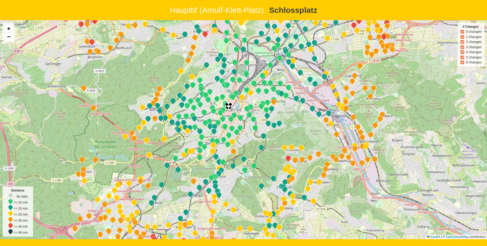

# Pendelstrecke

*Pendelstrecke* is a tool for visualizing the time needed for commuting trips within the VVS on a map. VVS is the local 
public transport in Stuttgart.

## How it works
The python script queries the VVS API for a trip from each station to one or more specified destination stations and 
saves the resulting data to a file. These results can then be viewed on a map. For every station, a colored marker 
indicates the duration that a commute to the destination will take from this location. Additionally, it is possible 
to filter the displayed stations by the number of changes needed for a connection.



## Usage

1. Download the CSV file containing all [VVS stations](https://www.openvvs.de).
2. Supply all configuration values, especially the path to your CSV file, in `pendelstrecke/config.yaml`. 
The destination station IDs can be obtained from the CSV file as well.
3. Install all dependencies and execute the script, e.g. by using the following commands.

```commandline
python3 -m venv venv
source venv/bin/activate
pip3 install -r requirements.txt --no-cache-dir
cd pendelstrecke/
python3 main.py
```

5. Open `map/index.html` in your web browser to view your results on the map. The navigation bar on the top can be used 
to switch between the specified destination stations.

## Credits
*Pendelstrecke* is based on the following open source projects.

* [vvspy](https://github.com/zaanposni/vvspy) is used for gathering data from the VVS API *(MIT License)*.
* [Leaflet](https://github.com/Leaflet/Leaflet) is used for displaying data on the map *(BSD 2-Clause License)*.
* [VVS OpenData Set](https://www.openvvs.de) provides the base data set *(CC BY 4.0 License)*.

## License
This project is licensed under the [GNU General Public License v3.0](https://www.gnu.org/licenses/gpl-3.0).

